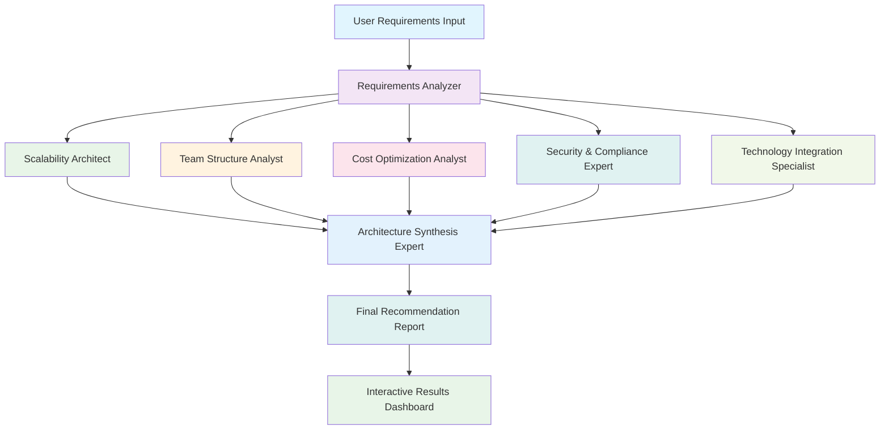

# 🏗️ AI Architecture Recommender

[](https://www.python.org/downloads/)
[](https://github.com/joaomdmoura/crewAI)
[](https://streamlit.io/)
[](LICENSE)
[](https://github.com/yourusername/ai-architecture-recommender/graphs/commit-activity)

> An intelligent multi-agent system that analyzes your project requirements and recommends optimal software architecture patterns using AI-powered analysis.

## 🚀 Overview

The AI Architecture Recommender is a sophisticated tool that leverages multiple AI agents working in collaboration to analyze your project requirements and provide comprehensive architecture recommendations. Built with CrewAI and Streamlit, it combines the expertise of specialized AI agents to evaluate scalability, team structure, cost optimization, and technical constraints.

### ✨ Key Features

- 🤖 **Multi-Agent Analysis**: Four specialized AI agents working together
- 📊 **Comprehensive Evaluation**: Scalability, cost, team structure, and technical analysis
- 🎯 **Smart Recommendations**: Tailored architecture patterns based on your specific needs
- 💡 **Interactive Interface**: User-friendly Streamlit web application
- 📈 **Real-time Analysis**: Live progress tracking and detailed reporting
- 🔧 **Customizable**: Easy to extend and modify for specific use cases

## 🎯 Who Is This For?

- **Software Architects** looking for AI-powered insights
- **Engineering Managers** planning new projects
- **Startup CTOs** making critical architecture decisions
- **Enterprise Teams** evaluating architecture modernization
- **Students & Researchers** learning about software architecture

## 🏛️ Architecture Overview

### Agent Flow Diagram



### 🤖 AI Agent Roles

| Agent | Role | Expertise |
|-------|------|-----------|
| **Scalability Architect** | Analyzes performance & scalability requirements | Load balancing, caching, database optimization |
| **Team Structure Analyst** | Evaluates organizational constraints | Conway's Law, team topology, communication patterns |
| **Cost Optimization Analyst** | Assesses financial implications | Cloud economics, resource optimization, TCO analysis |
| **Security and Compliance Expert** | Assesses security and compliance needs | Threat modeling |
| **Technology Integration Specialist** | Provides detailed integration plan | Advise on integration tools and platform |
| **Architecture Synthesis Expert** | Synthesizes all insights into final recommendations | Enterprise patterns, technology integration, decision making |

## 🛠️ Technology Stack

- **Frontend**: Streamlit (Interactive Web UI)
- **AI Framework**: CrewAI (Multi-agent orchestration)
- **Language Models**: OpenAI GPT-4, Claude, or custom models
- **Backend**: Python 3.8+
- **Configuration**: YAML-based agent and task definitions
- **Deployment**: Docker, Streamlit Cloud, or cloud platforms

## 📦 Installation & Setup

### Prerequisites

- Python 3.8 or higher
- OpenAI API key (or other supported LLM providers)
- Git

### Quick Start

```bash
# Clone the repository
git clone https://github.com/yourusername/ai-architecture-recommender.git
cd ai-architecture-recommender

# Install dependencies
pip install -r requirements.txt

# Set up environment variables
cp .env.example .env
# Edit .env with your API keys

# Run the application
streamlit run app.py
```

### Detailed Setup

1. **Clone and Setup**
   ```bash
   git clone https://github.com/yourusername/ai-architecture-recommender.git
   cd ai-architecture-recommender
   ```

2. **Install Dependencies**
   ```bash
   pip install -r requirements.txt
   ```

3. **Environment Configuration**
   ```bash
   # Copy environment template
   cp .env.example .env
   
   # Add your API keys to .env
   OPENAI_API_KEY=your_openai_api_key_here
   ANTHROPIC_API_KEY=your_anthropic_key_here  # Optional
   CREWAI_TELEMETRY_OPT_OUT=true
   ```

4. **Run the Application**
   ```bash
   streamlit run app.py
   ```

The application will be available at `http://localhost:8501`

## 📁 Project Structure

```
ai-architecture-recommender/
├── 📁 multi_agent_architecture_recommender/
│   ├── __init__.py
│   ├── crew.py                    # Main crew orchestration
│   └── 📁 config/
│       ├── agents.yaml           # Agent configurations
│       └── tasks.yaml            # Task definitions
├── app.py                        # Streamlit web application
├── requirements.txt              # Python dependencies
└── README.md                     # This file
```

## 🎮 Usage

### Basic Workflow

1. **Launch the Application**
   ```bash
   streamlit run app.py
   ```

2. **Input Your Requirements**
   - Project description and goals
   - Expected number of users
   - Technology preferences
   - Team size and structure
   - Budget constraints
   - Specific requirements

3. **Run Analysis**
   - Click "Run Analysis" button
   - Monitor progress through real-time updates
   - Review individual agent analyses

4. **Review Recommendations**
   - Comprehensive architecture recommendations
   - Detailed rationale for each decision
   - Cost estimates and trade-offs
   - Implementation roadmap

### Example Input

```yaml
Project: E-commerce Platform
Users: 100,000+ concurrent users
Team Size: 25 developers
Tech Stack: Python, React, PostgreSQL
Budget: $50,000/month
Special Requirements: 
  - High availability (99.9% uptime)
  - Global user base
  - Real-time inventory updates
  - PCI compliance required
```

## 📊 Sample Output

The system generates comprehensive reports including:

- **Architecture Pattern Recommendations** (Microservices, Serverless, etc.)
- **Technology Stack Suggestions** with rationale
- **Scalability Strategy** with specific implementation steps
- **Cost Analysis** with monthly estimates
- **Team Structure Recommendations** based on Conway's Law
- **Implementation Roadmap** with phases and milestones

## 🔧 Configuration

### Agent Customization

Modify `config/agents.yaml` to customize agent behavior:

```yaml
scalability_architect:
  role: Senior Scalability Architect
  goal: Analyze scalability and performance requirements
  backstory: You are a senior architect with 15+ years experience...
  max_iter: 3
  allow_delegation: false
```

### Task Configuration

Customize analysis tasks in `config/tasks.yaml`:

```yaml
scalability_analysis:
  description: Analyze the scalability requirements...
  agent: scalability_architect
  expected_output: Detailed scalability assessment...
```

## ☁️ Cloud Deployment

### Streamlit Cloud (Recommended)

1. Fork this repository to your GitHub account
2. Go to [Streamlit Cloud](https://share.streamlit.io/)
3. Connect your GitHub repository
4. Add your secrets (API keys) in the Streamlit Cloud dashboard:
   - `OPENAI_API_KEY`
   - `CREWAI_TELEMETRY_OPT_OUT=true`
5. Deploy with one click

Deployed app will be available at: `https://ai-powered-architecture-recommendation-zaoqdewv3vn5ljyv6ojqn8.streamlit.app/`

### Alternative Cloud Options

**Heroku:**
```bash
# Install Heroku CLI and login
heroku create your-app-name
heroku config:set OPENAI_API_KEY=your_key_here
git push heroku main
```

**Other Platforms:**
- Railway: Direct GitHub integration
- Render: Easy Python app deployment
- PythonAnywhere: Simple hosting for Python apps

## 🧪 Testing

```bash
# Run unit tests
python -m pytest tests/

# Run integration tests
python -m pytest tests/integration/

# Run with coverage
python -m pytest --cov=multi_agent_architecture_recommender tests/
```

## 🤝 Contributing

We welcome contributions! Please see our [Contributing Guide](CONTRIBUTING.md) for details.

### Development Setup

```bash
# Clone for development
git clone https://github.com/yourusername/ai-architecture-recommender.git
cd ai-architecture-recommender

# Install development dependencies
pip install -r requirements-dev.txt

# Install pre-commit hooks
pre-commit install

# Run tests
pytest
```

### Areas for Contribution

- 🎨 UI/UX improvements
- 🤖 New specialized agents
- 📊 Enhanced reporting features
- 🔌 Additional LLM provider integrations
- 📚 Documentation improvements
- 🧪 Test coverage expansion

## 📈 Performance Considerations

- **Analysis Time**: 2-5 minutes depending on complexity
- **Memory Usage**: ~500MB-1GB during analysis
- **API Costs**: Approximately $0.10-$1.00 per analysis
- **Concurrent Users**: Recommended 10-50 for single instance

## 🔒 Security & Privacy

- All API keys stored securely in environment variables
- User inputs are not logged or stored permanently
- Optional telemetry can be disabled
- Self-hosted deployment available for sensitive data

## 🐛 Troubleshooting

### Common Issues

**Issue**: CrewAI agents not responding
```bash
# Solution: Check API key and model availability
export OPENAI_API_KEY=your_key_here
python -c "import openai; print(openai.Model.list())"
```

**Issue**: Streamlit app won't start
```bash
# Solution: Check Python version and dependencies
python --version  # Should be 3.8+
pip install -r requirements.txt --upgrade
```

**Issue**: Long analysis times
```bash
# Solution: Use faster models or reduce complexity
# Modify config/agents.yaml to use gpt-3.5-turbo instead of gpt-4
```

## 🗺️ Roadmap

### Version 2.0 (Q2 2024)
- [ ] Support for additional LLM providers
- [ ] Advanced caching and performance optimization
- [ ] Export to common architecture documentation formats
- [ ] Integration with popular development tools

### Version 2.1 (Q3 2024)
- [ ] Real-time collaboration features
- [ ] Version control for architecture decisions
- [ ] Advanced cost modeling with real cloud pricing
- [ ] Mobile-responsive interface

### Version 3.0 (Q4 2024)
- [ ] Machine learning for recommendation improvement
- [ ] Integration with cloud provider APIs
- [ ] Advanced visualization and diagramming
- [ ] Enterprise features and SSO

## 📝 License

This project is licensed under the MIT License - see the [LICENSE](LICENSE) file for details.

## 🙏 Acknowledgments

- [CrewAI](https://github.com/joaomdmoura/crewAI) for the multi-agent framework
- [Streamlit](https://streamlit.io/) for the amazing web app framework
- [OpenAI](https://openai.com/) for providing powerful language models
- The open-source community for inspiration and contributions

## 📞 Support & Contact

- 📧 **Email**: support@your-domain.com
- 💬 **Discord**: [Join our community](https://discord.gg/your-invite)
- 🐛 **Issues**: [GitHub Issues](https://github.com/yourusername/ai-architecture-recommender/issues)
- 📖 **Documentation**: [Full Docs](https://your-docs-site.com)

## ⭐ Star History

[](https://star-history.com/#yourusername/ai-architecture-recommender&Date)

---

<div align="center">

**[⬆ Back to Top](#-ai-architecture-recommender)**

Made with ❤️ by the AI Architecture Team

</div>
